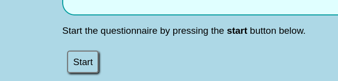
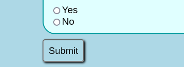
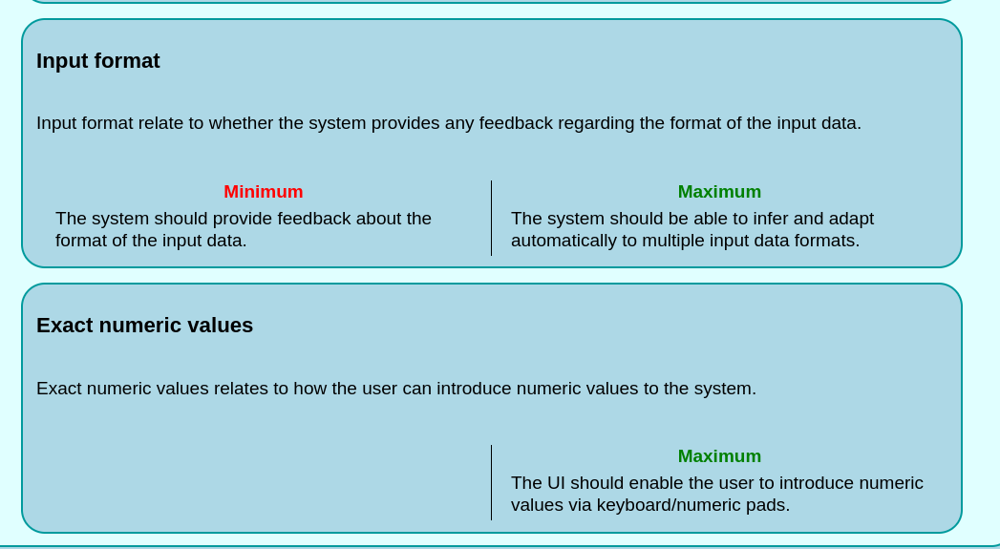

# HUMAIN

## About

This tool, the Human-Machine interaction modelling and validation
<b>(HUMAIN)</b> tool enables designers and developers to validate that their
interfaces cover all those aspects relevant to support an intuitive and
personalised interaction between humans and machines/robots. This tool is
especially intended for developers and UI/UX designers in the early stages of
front end development.

## Requirements

-   Server side:
    1. Any HTTP server software
    2. NodeJS and NPM
-   Client side
    1. Any modern browser compatible with ES2017 or later, such as:
        - Google Chrome 55 or later
        - MS Edge 15 or later
        - Safari 11 or later
        - Mozilla Firefox 52 or later
        - Opera 42 or later

## Installation

To install, simply download and unzip one of the zip files under **"Releases"**
or follow the instructions below to build from source.

### Building from source

1. Clone this repository
2. Install **NodeJS** and **NPM** if they're not already installed
    - On Ubuntu: `sudo apt install nodejs npm`
3. In the directory in which you've cloned this repository, run the following
commands to compile SCSS to CSS and Typescript to Javascript:
    - `npx sass style.scss style.css`
    - `npx tsc`

---

## Usage

### Server side

In its current state, this application is not backend specific, so you can
simply serve it through whichever HTTP server you'd like.

### Client side

On the client side, open the web browser and enter the URL that points to
index.html

#### Answering the questionnaire

Begin the questionnaire by clicking the "start" button.

Proceed to answer each visible question regarding your software, unless the
choices of that question are grayed out, like in the example below:

Once you're done answering the questions, click the "submit" button at the
bottom of the page

### Reading the recommendations

The recommendation tab includes recommendations for your software based on how
you answered the questionnaire.

If the questionnaire was properly filled out, clicking the "submit" button
should take you to the recommendation tab.

In the recommendation tab, you will see recommendation groups as collapsed
elements, as shown below:

To open these, simply click the arrow on the right side of the element.

Each recommendation will have a title, a description, and a **maximum** section.
Recommendations will also have a **minimum** section, unless it is determined
that your software should only use the maximum recommendation.

Below is an example of two recommendations that you may get:

To easily navigate to whichever recommendation you're looking for, there is a
list of links near the top of the recommendation page, separated by category.
You can click any of the links in order to rapidly scroll to the relevant
recommendation, as demonstrated below:

If you wish to read these recommendations as well as the questions and your
answers to them later, you may click the "Generate Report" button near the top
of the recommendation tab to download a report as a simple text file.

